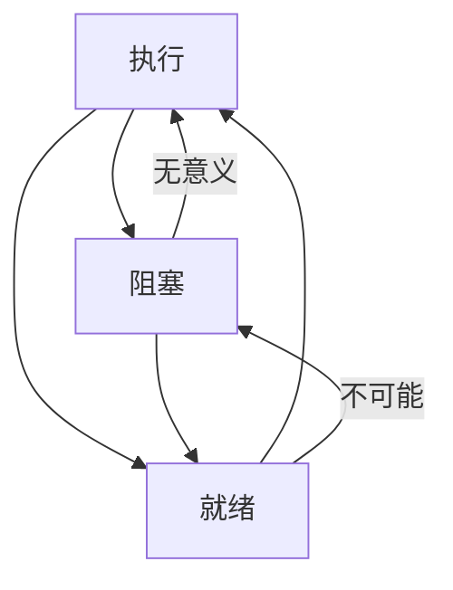

# 进程原理

## 进程

### 进程概论

进程，什么是进程？顾名思义，进程就是进展中的层序，或者说进程是执行中的程序。就是说，一个程序加载到内存后就变为进程。即：

```
进程 = 程序 + 执行
```

### 进程模型

CPU到底执行哪条指令由物理程序计数器指定。也就是说，在物理层面上，所有进程共用一个程序计数器。

而从逻辑层面上来看，每个进程可以执行，也可以暂时挂起让别的进程执行，之后又可以接着执行。这样，进程就需要某种办法记住每次挂起时自己所处的执行位置，这样才能在下次接着执行时从正确的地点开始。因此，从这个角度看，每个进程有着自己的计数器，记录其下一条指令所在的位置。从逻辑上说，程序计数器可以有多个。

而从时间上看，每个进程都必须往前推进。在运行一定的时间后，进程都应该完成一定的工作量，即每次进程返回，它都处于在上次返回点之后。

### 进程状态

进程分为3种状态：执行、阻塞、就绪。



**阻塞**到**执行**不可以是因为我们不让它发生。如果我们乐意，完全可以让操作系统在阻塞队列里挑选一个进程予以执行，只不过这个进程在执行第1条指令时就会又发生阻塞。因此，从理论上说，阻塞到执行是可以的，只不过这种状态转换没有任何实际价值而被操作系统禁止。

**就绪**到**阻塞**在理论上是不可以的。一个进程只能在执行时才能阻塞，没有执行的进程无法直接转换到阻塞状态。

### 进程管理

操作系统用于维护进程记录的结构就是进程表或进程控制块（Process Control Block，PCB）。

**进程的创建过程**

一般来说，创建进程的步骤如下所示：

1. 分配进程控制块。
2. 初始化机器寄存器。
3. 初始化页表。
4. 将程序代码从磁盘读进内存。
5. 将处理器状态设置为“用户态”。
6. 跳转到程序的起始地址（设置程序计数器）。

这里一个最大的问题是，跳转指令时内核态指令，而在第5步时处理器状态已经被设置为用户态，但在用户态下是不能执行内核态指令的。这个问题如何解决？当然了，这就需要硬件帮忙了。硬件必须将第5步和第6步作为一个步骤一起完成。

进程创建在不用的操作系统里方法也不一样。

例如，

UNIX将进程创建分为两个步骤：

1. fork，创建一个与自己完全一样的新进程；
2. exec，将新的进程的地址空间用另一个与自己完全一样的新进程，然后跳转到新程序的起始地址，从而完成新程序的启动。

Windows使用一个系统调用就可以完成进程创建。

进程管理的最大问题时资源分配：公平、效率。

## 进程调度

进程的调度就是操作系统进程管理的一个重要组成部分。其任务是选择下一个要运行的进程。

进程调度算法：

* 先来先服务调度算法
* 时间片轮转算法
* 短任务优先算法
* 优先级调度算法
* 混合调度算法
* 其他调度算法
* 实时调度算法

> 调度算法的迭代演化
  
**先来先服务调度算法(FCFS)**

先来先到的一个隐含条件就是不能抢占，一个程序一旦启动就一直运行到结束后者受阻塞为止。

**时间片轮转算法**

时间片轮转算法是对FCFS算法的一种改进，其主要目的是改善短程序的响应时间，其方法就是周期性地进行进程切换。

**时间片的选择**，时间片过大，时间片轮转会越来越像FCFS；时间片过小，则进程切换所用的系统消耗将太多，使得系统的大部分时间花在进程的上下文切换上，从而降低系统效率，并造成浪费。

**如何选择一个合适的时间片呢**，我们需要直到进程一次进程切换所用系统消耗和我们能够承受的整个系统消耗；时间片选择还需要考虑的一个因素是：有多少进程在系统里运行，运行多，时间片短一些；运行少，时间片可以适当长一些。

> 为什么还不是最优的调度算法？进程切换有消耗，时间片选择不容易，短任务的响应时间和交互体验不佳。

**短任务优先算法（STCF）**

短任务优先算法：用来改善短任务排在长任务后面轮转而造成响应时间和交互体验下降。算法的核心是所有程序并不都一样，而是有优先级的区分。

短任务优先算法有两种变种：

* 非抢占：让已经在CPU上运行的程序执行到结束或阻塞，然后再所有候选的程序中选择需要执行时间最短的进程来执行。
* 抢占：每增加一个新的进程就需要对所有进程（包括正在CPU上运行的进程）进行检查，谁的时间短，就运行谁。

> 怎么确认已经在运行的进程，还需运行多久？执行一段时间就记录一次，记录成本优点高。粗糙一点，执行完一次记录一次。

STCF算法的问题：

* 可能造成长程序无法得到CPU时间而导致“饥饿”。
* 重大缺点：我们怎么知道每个进程需要运行多久？

**优先级调度算法**

优先级调度算法的原理就是给每个进程赋予一个优先级，每次需要进程切换时，找一个优先级最高的进程进行调度。事实上，STCF算法本身就是一种优先级调度，只不过它给予短进程高优先级而已。

优先级调度算法的问题：

* 低优先级的进程可能会“饥饿”——动态调节优先级解决。
* 响应时间不能保证。

> 优先级是怎么指定的？

**混合调度算法**

之前介绍的所有算法都存在缺点，我们自然想设计一个算法合并它们的优点。这就是所谓的混合调度算法。该算法的原理是将所有进程分成不同的大类，每个大类一个优先级。如果两个进程处于不同的大类，则处于高优先级大类的进程优先执行；如果两个进程处于同一个大类，则采用时间片轮转来执行。

> 不同优先级怎么切换？

**其他调度算法**

* 保证调度：每个进程占用CPU的时间为1/n（新进程创建，怎么重新计算？）
* 彩票调度：概率调度算法
* 用户公平调度：按照每个用户而不是每个进程来进行公平分配（避免贪婪的用户可以通过启动许多进程来抢占CPU时间）
* 实时调度算法

**彩票调度算法**

在该算法里，给每个进程分发一定数量的彩票，而调度器则从所有彩票里随机抽取一张彩票，而持有该彩票的进程就获得CPU。

彩票调度算法的优越性是显而易见的。彩票算法可以用于模拟其他进程调度算法。例如，如果给每个进程一样多的彩票，则该算法就近似保证调度算法；如果给短任务赋予更多的彩票，则该算法将类似短任务优先算法。

那么彩票调度算法有什么用呢？比如，如果要保障A进程50%的CPU时间，那么就把一般的彩票分给A，这样的话就能保障50%的CPU时间。别的调度方法也可能达到这个效果，但是不灵活。

> 有哪些实际应用？概率调度，怎么保证没有“饥饿”？

> 进度调度算法的评估标准？

### 进程调度的过程

调度进程时操作系统锁执行的操作概览：

* 因时序或外部中断或进程挂起而导致操作系统获得CPU控制权。
* 操作系统在所有就绪的进程中按照某种算法遴选进程。
* 如果选中的是非当前进程，则操作系统将当前进程（中断或挂起的进程）状态予以保护。
* 将选中的进程的环境布置好（设置寄存器、栈指针、状态字等）。
* 跳转到选中的进程。

## 进程通信

进程间的交互称为进程间通信（Inter-Process Communication，IPC）。

例如，父进程在创建子进程后，通常需要监督子进程的状态，以便在子进程没有完成给定的任务时，可以再创建一个子进程来继续。这就需要父子进程间通信。

### 进程对白：管道、记名管道、套接字

管道：进程对白就是一个进程发出某种数据信息，另外一方接收数据信息，而这些数据信息通过一片共享的存储空间进行传递。

记名管道：如果要在两个不相关的进程之间进行管道通信，则需要使用记名管道。

套接字：是另外一种可以用于进程间通信的机制。功能非常强大，可以支持不同层面、不同应用、跨网络的通信。

管道、套接字方式存在的问题：

* 必须先建立连接，消耗系统资源。
* 通信是自愿的：一方虽然课可以随意向管道或套接字发送信息，但对方却可以选择接收的时机。
* 通信信息微小的情况下，通信成本较高（必须建立连接，消耗系统资源）。

### 进程电报：信号

需要一种不同的机制来处理如下通信需求：

* 迫使一方对我们的通信立即做出回应。
* 我们不想事先建立任何连接，而是临时突然觉得需要与某个进程通信。
* 传输的信息量微小，使用管道或套接字不划算。

信号，信号就是一个内核对象，或者说是一个内核数据结构。发送方将该数据结构的内容填好，并指明该信号的目标进程后，发出特定的软件中断。操作系统接收到特定的中断请求后，直到是有进程要发送信号，于是到特定的内核数据结构里查找信号接收方，并进行通知。接到通知的进程则对信号进行相应处理。如果对方选择不对信号做出响应，则将被操作系统终止运行。

> 能乱发信号？接收进程阻塞状态怎么处理？接收进程已终止怎么处理？

### 进程旗语：信号量

信号量，实际上就是一个简单整数，一个进程在信号量变为0或者1的情况下推进，并且将信号变为1或0来防止别的进程推进。当进程完成任务后，则将信号再变为0或1，从而允许其他进程执行。

信号量，不只是一种通信机制，更是一种同步机制。

### 进程拥抱：共享内存

共享内存，解决两个进程需要共享大量数据。

使用全局变量在同一个进程的进程间实现通信不称为共享内存。

### 信件发送：消息队列

消息队列是一列具有头和尾的消息排列。它无需固定的读写进程，任何进程都可以读写（当然是有权限的进程）。其次，它可以同时支持多个进程，多个进程可以读写消息队列。

