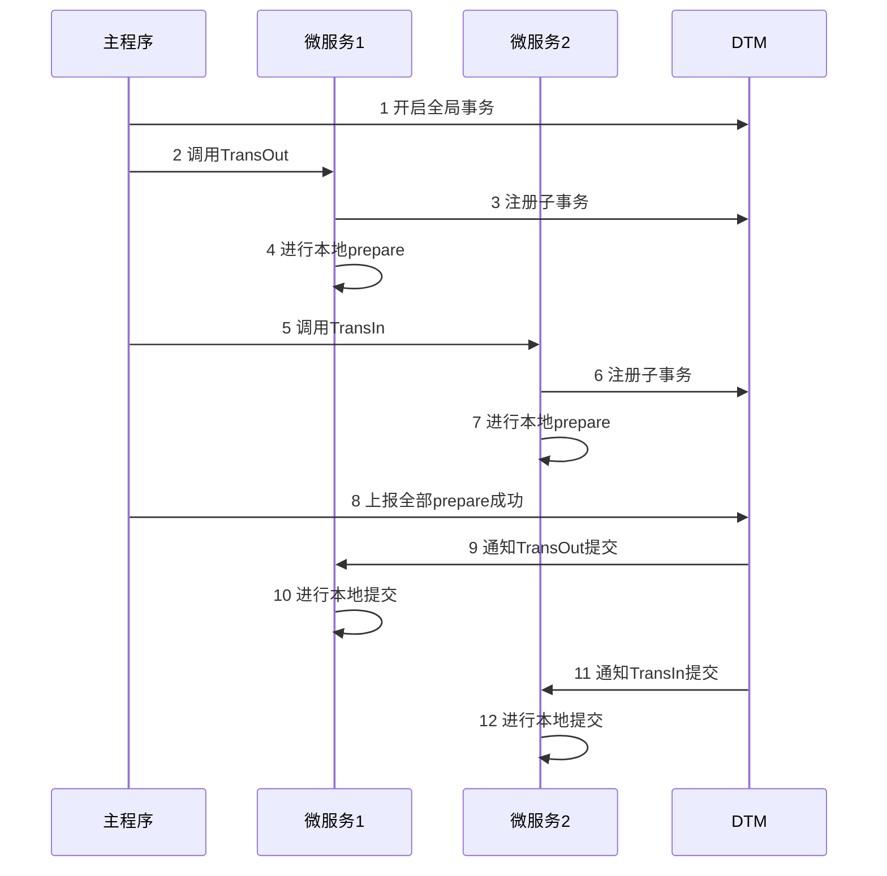

# 分布式事务

## **基础理论**

在讲解具体具体方案之前，我们先了解一下分布式事务所涉及的基础理论知识。

我们拿转账作为例子，A需要转100元给B，那么需要给A的余额-100元，给B余额+100元，整个转账要保证，A-100和B+100同时成功，或者同时失败。看看在各种场景下，是如何解决这个问题的。

### **事务**

把多条语句作为一个整体进行操作的功能，被称为数据库事务。数据库事务可以确保该事务范围内的所有操作都可以全部成功或者全部失败。

事务具有4个属性：原子性、一致性、隔离性、持久性。这四个属性通常称为ACID特性。

* 原子性（Atomicity）：一个事务中的所有操作，要么全部完成，要么全部不完成，不会结束在中间某个环节。事务在执行过程中发生错误，会被恢复到事务开始前的状态，就像这个事务从来没有执行过一样。
* 一致性（Consistency）：在事务开始之前和事务结束以后，数据库的完整性没有被破坏，完整性包括外键约束、应用定义的等约束不会被破坏。
* 隔离性（Isolation）：数据库允许多个并发事务同时对其数据进行读写和修改的能力，隔离性可以防止多个事务并发执行时由于交叉执行而导致数据的不一致。
* 持久性（Durability）：事务处理结束后，对数据的修改就是永久的，即便系统故障也不会丢失。

### **分布式事务**

银行跨行转账业务是一个典型分布式事务场景，假设A需要跨行转账给B，那么就涉及两个银行的数据，无法通过一个数据库的本地事务保证转账的ACID，只能够通过分布式事务来解决。

分布式事务是指事务的发起者、资源及资源管理器和事务协调者分别位于分布式系统的不同节点上。在上述转账的业务中，用户A-100操作和用户B+100操作不是位于同一个节点上。本质上来说，分布式事务就是为了保证分布式场景下，数据操作的正确执行。

**是否真的需要分布式事务**

## **分布式事务的解决方案**

* 两阶段提交/XA
* TCC（Try-Confirm-Cancel）
* 本地消息表
* 基于消息中间件的最终一致性事务方案
* 最大努力通知
* SAGA事务
* AT事务模式

### **两阶段提交/XA**

把上面的转账作为例子，一个成功完成的XA事务时序图如下：

### **分布式事务中的网络异常**

在分布式事务的各个环节都有可能出现网络以及业务故障等问题，这些问题需要分布式事务的业务方做到防空回滚、幂等、防悬挂三个特性。

## **参考文献**

1. [干货 | 一篇文章带你学习分布式事务](https://mp.weixin.qq.com/s/RDnf637MY0IVgv2NpNVByw)
2. [分布式事务，这一篇就够了](https://xiaomi-info.github.io/2020/01/02/distributed-transaction/)
3. [1.4 w字，25 张图让你彻底掌握分布式事务原理](https://mp.weixin.qq.com/s/ujRRtdLOeKEHsHrtDRNXGA)